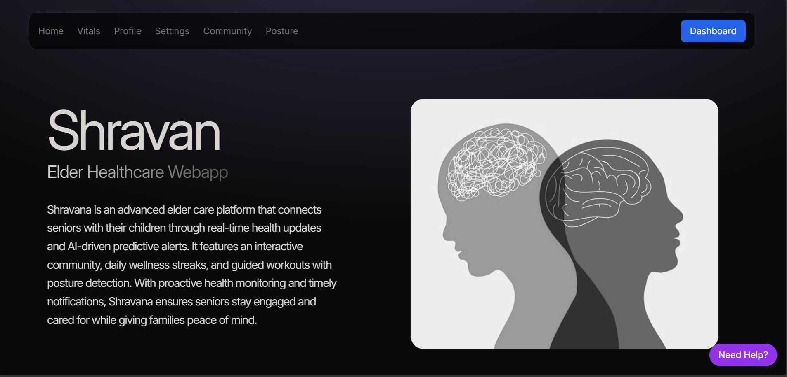
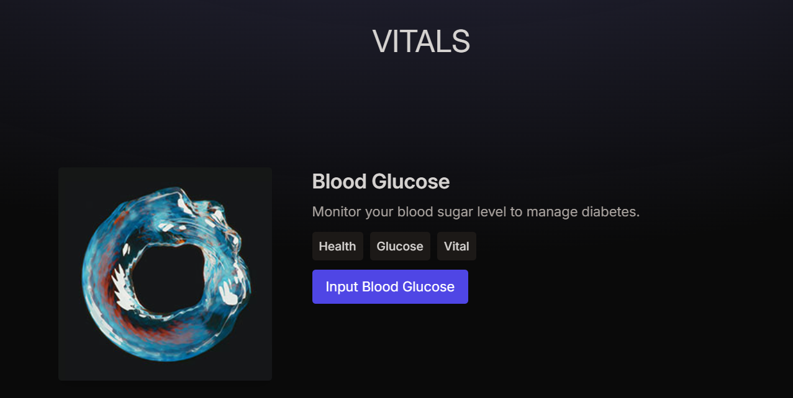
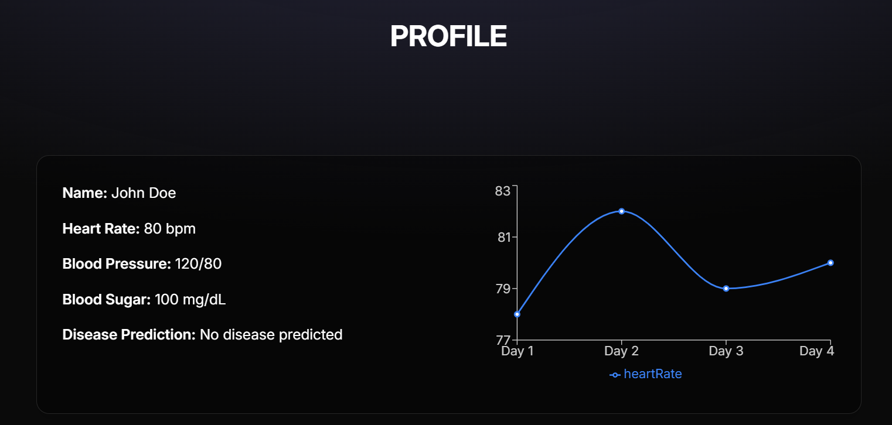
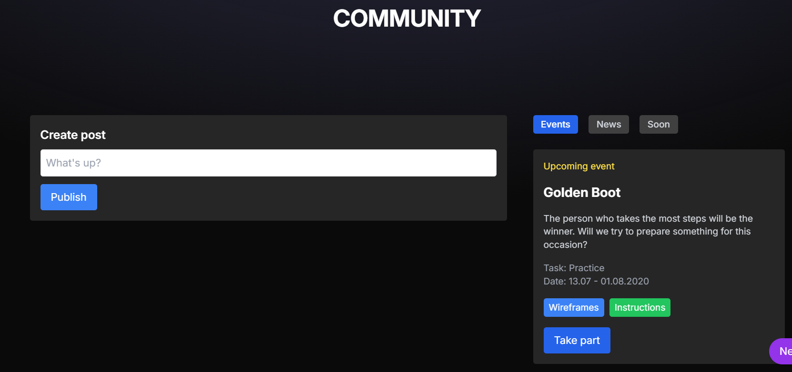
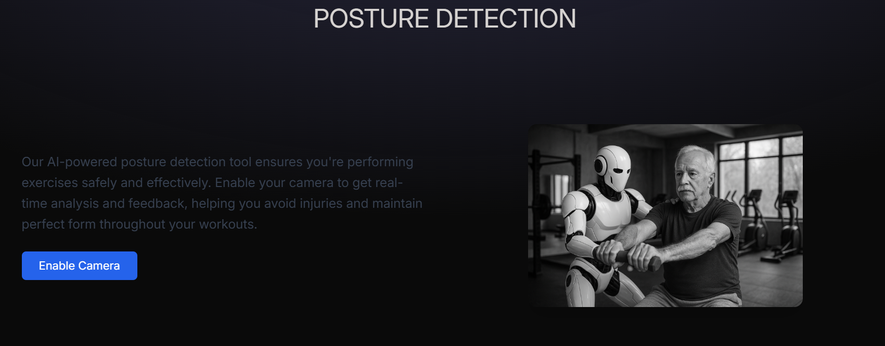
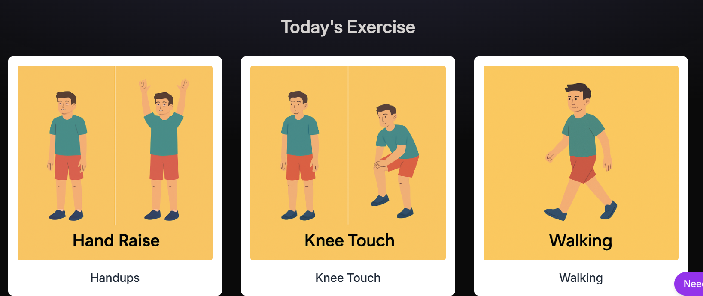

# 🩺 Shravana — Elder Healthcare Platform

Shravana is an elder healthcare web platform designed to help senior citizens stay connected with their caregivers and family members through health monitoring, wellness activities, community interaction, and AI-assisted posture detection.

The platform brings important healthcare and wellness features together into a single, easy-to-use web application.

---
## 📸 Screenshots

### 🏠 Landing Page



### ❤️ Health Vitals



### 📊 Health Profile



### 👥 Community



### 🤖 Posture Detection



### 🏃 Exercise & Wellness



---
## 🚀 Features

### 👨‍👩‍👧 Parent & Caregiver Roles

Shravana provides separate user roles for:

- Parent
- Caregiver

This allows the platform to support elderly users as well as the people responsible for their care.

---

### ❤️ Health Vitals Monitoring

Shravana provides an interface for recording and monitoring important health metrics:

- Blood Glucose
- Diastolic Blood Pressure
- Systolic Blood Pressure
- Cholesterol
- BMI
- HbA1c

Users can enter their health values and monitor their information through the platform.

---

### 📊 Health Profile & Visualization

The profile section provides an overview of health information along with graphical visualization.

It includes:

- Heart Rate
- Blood Pressure
- Blood Sugar
- Health History
- Disease Prediction Information
- Health Data Visualization

> The health values displayed in the current demo are sample data intended for demonstration purposes.

---

### 🤖 AI-Assisted Posture Detection

Shravana includes a camera-based posture detection feature designed to provide real-time feedback during exercises.

The feature is intended to help users:

- Maintain proper exercise posture
- Perform exercises more safely
- Receive movement feedback
- Reduce incorrect movements
- Improve exercise form

---

### 🏃 Exercise & Wellness

The application provides guided wellness activities and exercises, including:

- Hand Raise
- Knee Touch
- Walking

Visual instructions are provided to help users understand the exercises.

---

### 👥 Community

The Community section allows users to interact with the platform through:

- Creating posts
- Viewing community events
- Viewing news
- Participating in activities

The goal is to encourage social engagement and wellness participation.

---

### 💬 Help & Assistance

The application includes an integrated help/chat interface to assist users while navigating the platform.

---

## 🛠️ Tech Stack

### Frontend

- React.js
- Vite
- JavaScript
- HTML5
- CSS3
- Tailwind CSS

### AI / Computer Vision

- Camera-based posture detection
- Real-time movement analysis

### Development Tools

- Visual Studio Code
- Git
- GitHub
- npm

---

## 📂 Project Structure

```text
Project-Shravan/
│
├── login/
│   └── colorlib-regform-26/
│
├── public/
│   ├── KneeTouch.png
│   ├── Walking.png
│   ├── hand.png
│   └── workout.png
│
├── src/
│   ├── assets/
│   │
│   ├── components/
│   │   ├── Chatbot.jsx
│   │   ├── Community.jsx
│   │   ├── Hero.jsx
│   │   ├── LandingPage.jsx
│   │   ├── Login.jsx
│   │   ├── Navbar.jsx
│   │   ├── ParentDashboard.jsx
│   │   ├── Profile.jsx
│   │   ├── Projects.jsx
│   │   ├── Pysio.jsx
│   │   ├── Settings.jsx
│   │   ├── Signup.jsx
│   │   ├── Workout.jsx
│   │   └── ui/
│   │
│   ├── constants/
│   │   └── index.js
│   │
│   ├── App.jsx
│   ├── index.css
│   └── main.jsx
│
├── .gitignore
├── eslint.config.js
├── index.html
├── package.json
├── package-lock.json
├── postcss.config.js
├── tailwind.config.js
├── vite.config.js
└── README.md
```

---

## ⚙️ How to Run

### Prerequisites

Make sure you have the following installed:

- Node.js
- npm
- Git

### 1. Clone the repository

```bash
git clone https://github.com/PrashantMaan/Project-Shravan.git
```

### 2. Navigate to the project directory

```bash
cd Project-Shravan
```

### 3. Install dependencies

```bash
npm install
```

### 4. Start the development server

```bash
npm run dev
```

### 5. Open the application

Open the URL displayed in the terminal.

Usually:

```text
http://localhost:5173
```

---

## 🔄 Application Flow

```text
                    ┌───────────────────┐
                    │     SHRAVANA      │
                    │   Landing Page    │
                    └─────────┬─────────┘
                              │
                  ┌───────────┴───────────┐
                  │                       │
             Parent Role             Caregiver Role
                  │                       │
                  └───────────┬───────────┘
                              │
                         Dashboard
                              │
        ┌─────────────┬───────┼────────┬────────────┐
        │             │       │        │            │
      Vitals       Profile  Workout  Community   Posture
        │                                      Detection
        │
   Health Metrics
        │
   ┌────┴─────────────┐
   │                  │
Blood Glucose     Blood Pressure
   │
BMI / Cholesterol / HbA1c
```

---

## 🎯 Project Objective

The objective of Shravana is to provide a centralized digital platform for elder healthcare management.

The platform combines:

- Health monitoring
- Exercise guidance
- Posture detection
- Wellness activities
- Community interaction
- Caregiver support

into a single web application.

The project focuses on improving accessibility, engagement, and communication between elderly users and their caregivers.

---

## 📌 Current Project Status

The current version is a functional frontend prototype demonstrating the core user interface and healthcare workflow.

The application includes interactive pages for:

- Health monitoring
- User profiles
- Community activities
- Exercises
- Posture detection
- Parent and caregiver experiences
- Help and assistance

---

## 🔮 Future Improvements

The following features can be added in future versions:

- Real-time database integration
- Wearable health-device integration
- Advanced AI-based disease prediction
- Improved posture classification
- Automated caregiver alerts
- Health report generation
- Personalized exercise recommendations
- Secure authentication and authorization
- Cloud deployment
- Mobile application support
- Real-time health notifications
- Personalized health recommendations

---

## ⚠️ Disclaimer

Shravana is a student/development project created for educational and demonstration purposes.

The health values and predictions shown in the demo are sample data and should not be used for medical diagnosis or clinical decision-making.

---

## 👨‍💻 Author

**Prashant Maan**

B.Tech Computer Science — AI/ML

---

## ⭐ Support

If you find this project interesting, consider giving the repository a ⭐ on GitHub.